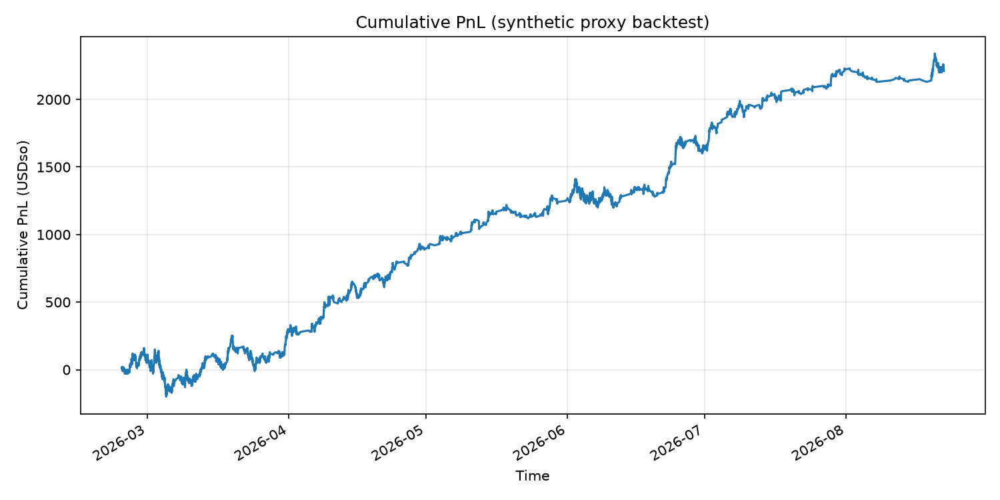

# Binal Bot

**A validated, autonomous, and copyable trading agent for DreamDEX Event Contracts.**

 Every decision (trade or skip) is logged in it's journal with full reasoning. Every result is posted publicly and linked back to the call that produced it. And anyone can follow the bot's exact trades with their own funds, non-custodially.

[Agent Dashboard](https://dreamdex-binal-bot-5by9.onrender.com) | [Copy Trade](https://dreamdex-binal-bot-5by9.onrender.com/copy-trade.html) | [Copy-service repo](https://github.com/youthisguy/Binal_copy_serve) | [Telegram](https://t.me/binal_bot_signals)

---

## What it is

Binal Bot is an automated signal bot trading binary Up/Down event contracts on [DreamDEX](https://docs.dreamdex.io) (Somnia). It watches short-window markets, computes a fair probability against the market's own price, and takes a directional position (`BUY_YES`/`BUY_NO`) whenever its edge clears a threshold, never outside the odds regime its edge was proven in.

Every signal is logged, posted to the Binal Bot [Telegram channel](https://t.me/binal_bot_signals) as a stat-card image, and shown on the [agent dashboard](https://dreamdex-binal-bot-5by9.onrender.com) in real time. On top of that, a copy-trade system lets any wallet holder mirror Binal's signals automatically with their own funds, sized to their own risk tolerance.

---

## The signal
 
DreamDEX's own reference implementation for Event Contract trading documents its forecasting model as a placeholder. Binal Bot fills that gap with a real one: an EMA(3)/EMA(12) momentum crossover, validated through a full research pipeline (180 days of BTC/ETH price history), a 36-combination grid search with Bonferroni-corrected significance testing, and a chronological walk-forward split that never let the model see its own test data. The result held up out-of-sample: a **56.8% win rate on fully unseen data, statistically significant at p=0.00033**.
 

 
Full methodology, grid search results, and raw backtest data: [research repository](https://github.com/youthisguy/dreamdex-agent-backtest.git).
 
That signal now runs live, gated by risk controls tuned against real production behavior:
 
1. **Window filter:** restricts trading to the validated 15-minute horizon (`OF_ALLOWED_WINDOWS_MIN`)
2. **Momentum-required gate:** a trade only fires when the validated EMA signal actually contributed (`OF_REQUIRE_MOMENTUM`)
3. **Entry-price ceiling:** refuses entries priced above a configurable threshold (`OF_MAX_ENTRY_PRICE`), keeping the bot inside the odds regime its win rate was actually proven  at

---

## The transparency layer

Every trade is written to a structured, append-only journal the moment it happens. It's reasoning, entry odds, the reference price it's trading against, and a direct link to the market. A live dashboard reads that journal in real time: running win rate, cumulative PnL, and why the bot chose *not* to trade on every pass it sat out, so its discipline is as visible as its wins.

The same data feeds a public Telegram channel. Every signal posts as a stats card message — direction, edge, entry price, stake size, time remaining, and the bot's running track record, with a one-tap link straight into the DreamDEX market. When that market settles, the result posts as a reply to the original call, so the outcome is permanently and visibly tied to the reasoning that produced it. 

## The persistence layer
 
Because the bot runs on infrastructure with ephemeral disk, trade history is checkpointed to GitHub automatically — every decision and every settlement commits and pushes in the background, and a fresh deployment restores full history before the bot ever takes its first action. A redeploy, a crash, a platform migration: the track record survives all of it, verifiable in the same repository the code lives in: [`strategies/ec-oracle-follow/logs/decisions.jsonl`](./strategies/ec-oracle-follow/logs/decisions.jsonl).


## Copy trading

Binal's signals aren't just observable, they're actionable. Users interact with **`CopyVault`** (a non-custodial, per-user contract) through the [Copy Trade](https://dreamdex-binal-bot-5by9.onrender.comcopy-trade.html) page:

1. Connect wallet → approve + **deposit**
2. **Set trade size** (a hard per-position cap)
3. **Enable copy**
4. Every live signal is mirrored for opted-in wallets; settlements credit idle balance
5. **Withdraw** anytime from idle funds

The agent never holds user funds. It only notifies the copy service:

| Webhook | When | Payload (conceptually) |
|---|---|---|
| `POST /api/signal` | Bot takes a trade | `marketId`, `side`, `price`, `pool`, `expiryMs`, … |
| `POST /api/settlement` | Market resolves | `marketId`, `outcome`, `payoutPerShare`, `winningSide` |

Both require a shared secret header (`x-webhook-secret`). Full contract, API, and deploy detail: **[Binal_copy_serve](https://github.com/youthisguy/Binal_copy_serve)**.

---

## Testnet → Mainnet migration
 
- **Sep 1, 09:35 – Sep 4, 16:45:** Testnet only. Trades 1–10 were posted with the token labeled `USDC` (a display bug — actual balance was Somnia Shannon testnet tUSDC from the faucet). From trade 11 onward the label was corrected to `tUSDC`. Position size was a flat 200 units per trade.
- **Sep 4 16:45 → Sep 8 07:08:** ~3.5 day gap. The testnet environment was intermittently down and running with high latency over this period, blocking reliable execution. Rather than let that stall the demo, we migrated to mainnet to keep the product moving.
- **Sep 8, 07:08 onward:** Mainnet. Token is `USDso` (native Somnia mainnet USD stable), the trade counter reset to 1, and position size dropped to a flat 15 units per trade — real capital, sized conservatively.
Full trade-by-trade history (every signal and settlement, testnet and mainnet) is in [`data/trade-history.json`](./data/trade-history.json).

**Why mainnet:** Testnet was unreliable in the final days of development. It kept going down and had known network-wide latency issues. So we migrated to mainnet to demo the product properly.

## Deployed contracts
 
`CopyVault` — the non-custodial, per-user vault the copy service operates against (deposit/withdraw always user-controlled; operator can only open/settle positions for opted-in wallets, capped at each user's own trade size):
 
| Network | CopyVault address |
|---|---|
| **Mainnet** | `0x921772bf13175E5E39672154bDe3C521d859eFCA` |
| **Testnet** (Somnia Shannon) | `0xBE24664ebC322aBA45bbA28d05b11B0f9D3E5Ed0` |
 
---

## Architecture
 
Two independent deployments, deliberately decoupled — the copy service can be down, slow, or mid-redeploy without ever affecting the main bot's own trading loop.
 
```
Main bot (ec-core, journal, Telegram)
        │
        │  POST /api/signal      (+ secret)
        │  POST /api/settlement  (+ secret)
        ▼
Copy service (ethers + SQLite)
        │
        │  openPositionFor / redeemMarket / settlePosition
        ▼
CopyVault (per-user balances)
```
 


**1. Main bot:** runs the trading loop and serves the live dashboard.
**2. Copy-trade service:** a fully standalone Node service. Talks only to the bot only via two webhooks, and to the blockchain directly.

### Main bot components

| File | Role |
|---|---|
| `index.ts` | Main loop: scans markets, computes edge, places the bot's own trade via `ec-core`'s `placeLimit`, writes the journal entry, fires the copy-signal webhook, posts to Telegram |
| `signal.ts` | Signal/edge computation logic |
| `journal.ts` | Append-only JSONL trade history (`logs/decisions.jsonl`); `backfillSettlements()` polls for resolved markets and fires the copy-settlement webhook |
| `telegram.ts` / `card.ts` / `embedded-fonts.ts` / `social-format.ts` | Posts each signal to Telegram as a rendered stat-card image with inline buttons |
| `checkpoint.ts` | Commits the journal to GitHub on every write, since Render's disk is ephemeral |
| `position.ts` | Net/gross exposure accounting (YES vs NO offsetting) |
| `timeout.ts` | Wraps SDK calls in a timeout so a hung network call can't freeze the sequential main loop |
| `copy-signal.ts` | Fire-and-forget POSTs to the copy-service — `notifyCopyService()` on every signal, `notifyCopySettlement()` on every resolution. No-op unless `COPY_SERVICE_URL` is set |
| `index.html` + `server.mjs` / `prod-server.mjs` | Static dashboard showing the live decision feed; serves any file dropped in the same directory, including the copy-trade page |

### Copy-trade components

| File | Role |
|---|---|
| `CopyVault.sol` | Deployed contract. Per-user tracked balances. `deposit`/`withdraw` always available to the user. Operator can only `openPositionFor`/`settlePosition` on users who opted in (`copyEnabled`), capped per-trade by each user's own `tradeSize`. Fee taken only on realized profit, hard-capped at 20% in code |
| `local-server.mjs` | Standalone backend. Receives signal/settlement webhooks, opens/settles vault positions as the operator, tracks trade history + leaderboard in SQLite, serves the dashboard's API |
| `copy-trade.html` | Dashboard page: wallet connect (MetaMask, auto-prompts adding Somnia Shannon Testnet), deposit/withdraw, set trade-size cap, enable/disable copying, live leaderboard and personal trade history |

---

## Execution flow, end to end

**Signal → trade → copy:**

1. `index.ts` finds a tradable market with sufficient edge and places its own order via `ec-core`.
2. Writes a `decision` record to the journal (the dashboard picks this up immediately).
3. Fires `notifyCopyService()` — fire-and-forget, 5s timeout — with `{ marketId, symbol, side, price, pool, expiryMs }`. `pool` is included specifically so the copy-service never needs `ec-core` access of its own.
4. Posts the signal to Telegram (independent of step 3 — one failing doesn't block the other).
5. `local-server.mjs` receives the signal, loops over every registered wallet, checks `getAccount()` on-chain for `copyEnabled` and available balance, sizes each user's trade at `min(tradeSize, idleBalance)`, and calls `openPositionFor` as the operator for each opted-in user.
6. Each open position is recorded in SQLite with its transaction hash.

**Settlement → payout:**

7. The bot's existing `backfillSettlements()` loop detects a resolved market, computes its own payout/outcome, logs it, and fires `notifyCopySettlement()` with `{ marketId, outcome, payoutPerShare }`.
8. `local-server.mjs` finds every `OPEN` copy-position on that market, scales `payoutPerShare` to each user's own share count, and calls `settlePosition` per user — the contract computes and deducts its fee on realized profit only.
9. The leaderboard and each user's PnL update from this settled data.

**User-facing flow:**

- Connect wallet → approve + `deposit()` → `setTradeSize()` (per-trade cap) → `setCopyEnabled(true)`.
- `withdraw()` always works regardless of operator or copy state.
- Leaderboard and personal trade history poll `local-server.mjs`'s API every 5 seconds.

---

## Setup

```bash
git clone <this repo> && cd dreamdex-bot-kit
npm install
cp .env.example .env    # PRIVATE_KEY, NETWORK=testnet, VENUE_ID
npm start -w ec-oracle-follow
```

See `strategies/ec-oracle-follow/README.md` for the full signal/config reference.

### Key environment variables

| Variable | Default | Meaning |
|---|---|---|
| `OF_ALLOWED_WINDOWS_MIN` | `15` | Only trade windows this length (minutes) — matches the validated backtest |
| `OF_REQUIRE_MOMENTUM` | `true` | Only trade when the validated EMA signal contributed |
| `OF_MAX_ENTRY_PRICE` | `0.7` | Refuse entries priced above this, regardless of raw edge size |
| `TELEGRAM_BOT_TOKEN` / `TELEGRAM_CHAT_ID` | — | Enables the public signal feed (opt-in, no-op unset) |
| `GITHUB_REPO` / `GITHUB_TOKEN` | — | Enables automatic journal checkpointing to git (opt-in, no-op unset) |
| `DASHBOARD_URL` | — | Public dashboard URL, linked from every Telegram post |
| `COPY_SERVICE_URL` | — | Enables the copy-trade webhook integration (opt-in, no-op unset) |

Copy-trade service setup (separate deployment):

```bash
cd copy-service
npm install
# Required: COPY_RPC_URL, COPY_VAULT_ADDRESS, COPY_BOT_OPERATOR_PRIVATE_KEY
node --env-file=.env local-server.mjs
```

---

## Status

**Confirmed working on testnet:** the full signal → validated backtest → live trading pipeline; the journal/dashboard/Telegram transparency layer, including reply-based settlement and automatic git checkpointing; and the full copy-trade path — deposit, set trade-size cap, enable/disable copying, withdraw, and the push-based signal → open-position → settle → leaderboard pipeline.

---

## License & disclaimer

Built on the [DreamDEX Bot Kit](https://github.com/somnia-chain/dreamdex-bot-kit) (MIT License, © DreamDEX S.A.) — see repository for the underlying SDK, execution primitives, and event-contract mechanics this project extends.

This is educational/hackathon reference code — **not financial advice, and not audited.** Any strategy can lose funds. You are responsible for the keys you load, the parameters you set, and the funds you commit.